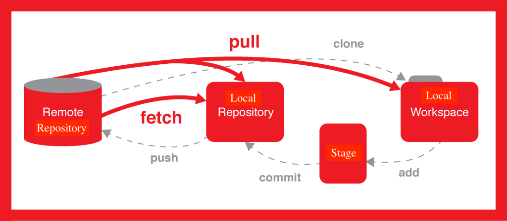

# UCL Data Science Society - Term 2 Workshop 6: Introduction to Git/Github

Created by Zhaoxuan "Tony" Wu, First-Year Representative of Science Divison, *UCL Data Science Society*

[See me on _Github_🙋‍♂️](https://github.com/TonyWu3027)

## Table of Contents

-   Introduction to _Git_ and _Github_
-   Manage your own project with _Git_
-   `.gitignore` and what to be ignored
-   Upload your personal project to _Github_ 
-   Branch
-   Collaberative projects and how to collaberate using _Git_ and _Github_
-   Example: _Attendance Sheet_ 

## Prerequisition

### _Git_

You should download [_Git_](https://git-scm.com/downloads). Feel free to check the [_official documentation_](https://git-scm.com/docs) if you are interested in. We will be using the _Terminal_, so it might be helpful to get familiar with the commands. 

Recommended Terminal for MacOS: _iTerm2_ 

Recommended multi-lang IDE: _Atom_, _Visual Studio_, _Sublime Text_, or _Vim_, which is pre-installed on MacOS

### _Github_

Get yourself a _Github_ account, it's free! If you prefer graphical interface, [_Github Desktop_](https://desktop.github.com). But we are going to learn _Git_ and _Github_ using command line today.

## What is _Git_, and Why?

>   *Git is a [free and open source](https://git-scm.com/about/free-and-open-source) **distributed version control system** designed to handle everything from small to very large projects with speed and efficiency.* 

-   Industrial production standard
-   Hackathon
-   Writing a book
-   Keeping lecture nots
-   ...

## How is it different from _Github_?

_Git_ is a ***system*** that manages the version control of a project, while _Github_ is a ***remote platform*** that hosts that project using _Git_. For instance: `git push` uploads your current local repository to _Github_

## Relationship



>   ***Repository*** ("Repo") : a receptacle or place where things are deposited or stored

## Your first _Git_ repo

Do the following on your own _Terminal_

### Initialisation of project

Create a _directory_ (folder) for your project:

```bash
mkdir myapp
```

Go to that directory:

```bash
cd myapp
```

Initialise the project with _Git_ so that _Git_ manages the version control of the project:

```bash
git init
```

Now you should have a `.git` folder in your directory, which is invisible currently. Also, your current project  is called the _local workspace_.

### Make changes

Now, create an `app.py` _Python_ file in this folder and write a line of code that outputs `"Welcome to DSS Workshop 6"`

```python
key = ""

def getKey():
     f = open("key.txt","r")
     key = f.read()
     f.close()

def login(account,password, ):
     if account ==
```


You can do it with your IDE or with command line. The method for doing that using command line is as the following:

Create  `app.py` :

```bash
touch app.py
```

Edit the file using the built-in editor _Vim_, or use IDE:

```bash
vim app.py
```

```python
key = ""

def getKey():
     f = open("key.txt","r")
     key = f.read()
     f.close()

def login(password):
     if account == key:
          print("successful")
     else:
          print("denied")
```

Save the file and quit:

```bash
:wq
```

### Stage the changes

Before you commit your changes, you should _add_ your changes to the stage, or "_stage_" it.

```bash
git add .
```

>   ***Note that***: `git add` takes in a parameter, which is the filename. For example, you can do `git add app.py` to stage `app.py`, `git add .` is the wildcard mode that stages ***every*** file that has been changed

 To check your _stage_:  

```bash
git status
```

### Commit the changes

Now, commit your changes:

```bash
git commit -m "first commit"
```

>   ***Note that***: `git commit` takes in commit comment using the `-m` flag,  followed by your comment string. It can be anything. Here we use `"first commit"` as example, which is usually what you do for your first commit literally

Congrats! 🥳 You just commited your first contribution to the project! Now this version of commit is officially in your _local repository_ (_local repo_). 

### Create another file

Now create another file `key.txt` with whichever method you like and write the following line:

```bash
"ucldssistheBEST:)"
```

>   Don't stage it yet

## Security, security, security, and `.gitignore`

You might notice that it is quite dangerous to commit a copy of your `key.txt` to a _repo_ or a _remote repo_. 

-   API keys
-   Database password
-   Credentials 
-   Biometrics data
-   Data under NDA
-   `.DS_Store`
-   `/node_modules`
-   ...

By using `.gitignore`, you can prevent certain files to be commited to a _repo_

```bash
touch .gitignore
```

Directly add the name of the files you want to hide to that `.gitignore` file:

```bash
vim .gitignore

.DS_Store
key.txt
```

Save and quit:

```bash
:wq
```

Now, _stage_ and _commit_ everything and see what happen.

### _Remote repo_ and _Github_

Now you might want to share your code with other developer, you can do this by putting your project on a remote repo. Do this by call the following function:

```
seeTonyForLiveDemo()
```

### _Branching_, and uploading changes to _remote repo_

For instance, you want to create an _HTML_ for your app. Create and switch to a new branch called `html`:

```bash
git checkout -b html
```

>   ***Note that***: `-b` flag is for creating a new branch. If you want to see all available branches, use `git branch`, if you want to switch to an existing branch, use `git checkout <branch>` where `<branch>` is the branch name

Craete your HTML: 

```html
<html>
	<head>
 		<title>UCL DSS</title>
 	</head>
 	<body>
 		<h1> My heading</h1>
 		<p> Your first programme/page for any languages should always be: Hello World! </p>
 	</body>
 </html>
```

_Stage_ it, check the _stage_, _commit_ it. Now, upload it:

```bash
git push -u origin html
```

Go to your  _Github_ repo to see what happened.

## Collaborative Coding: 101

>   To be implemented

If that's not your own project:

-   fork an existing project
-   Upload to your know repo
-   Pull request
-   Keep your repo the same 

```
git remote -v
git remote add upstream <your_upstream>
git fetch upstream
git merge upstream/master
git push -u origin upstream
```

If that's your own project:

-   Manage pull request
-   Merge

## Practice: Signing an attendance sheet

